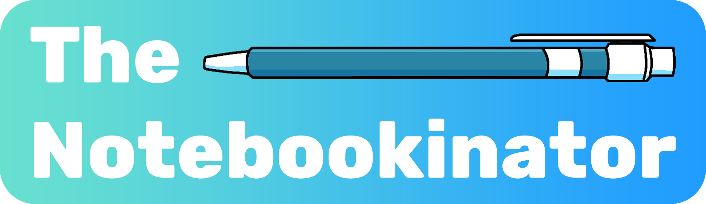
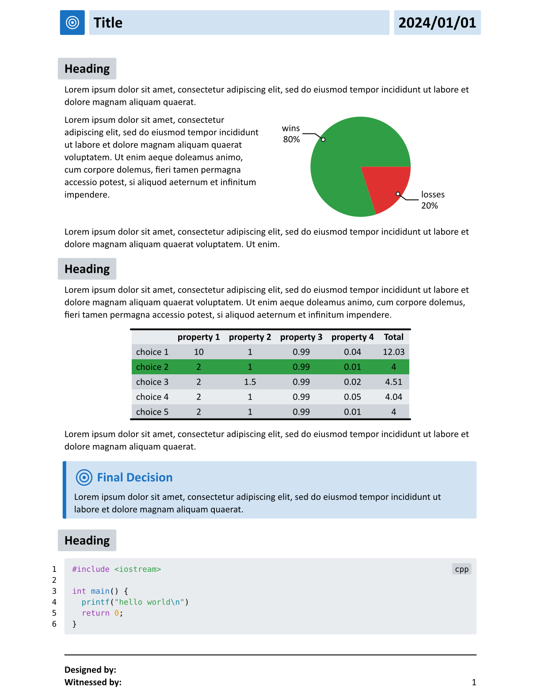
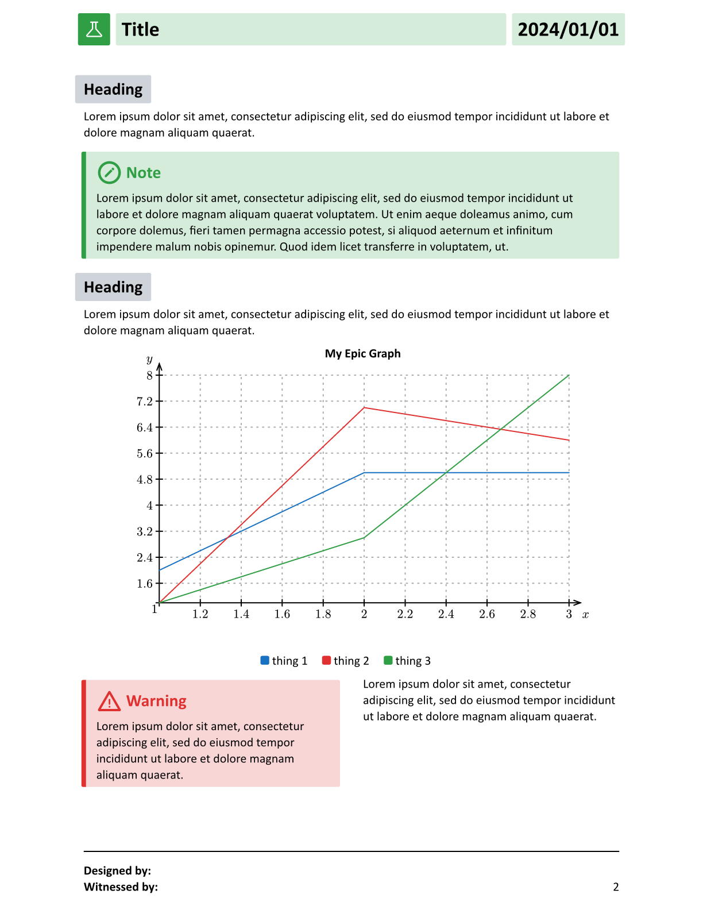
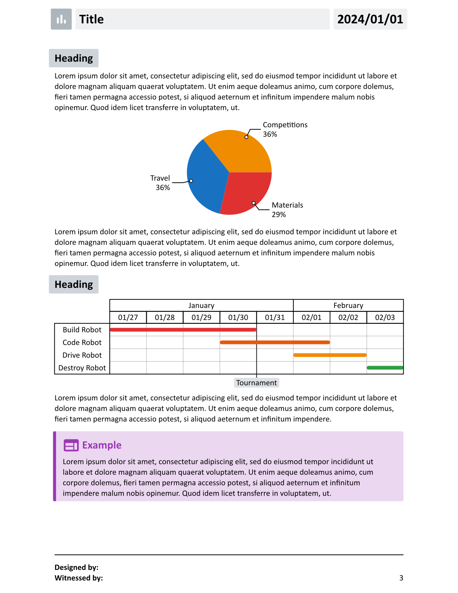
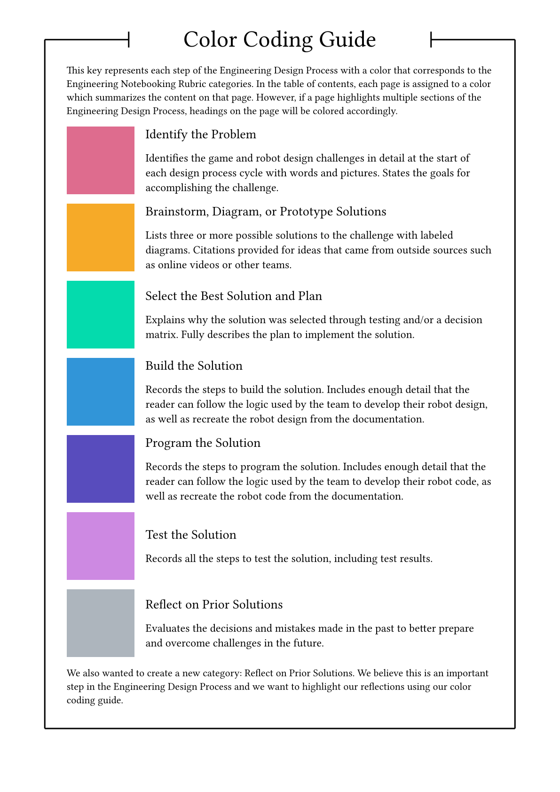
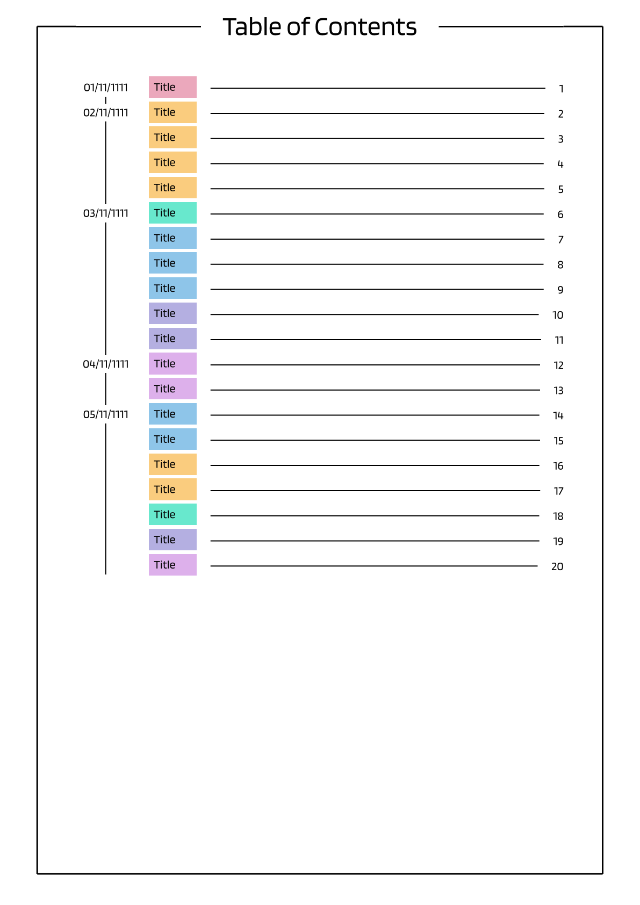
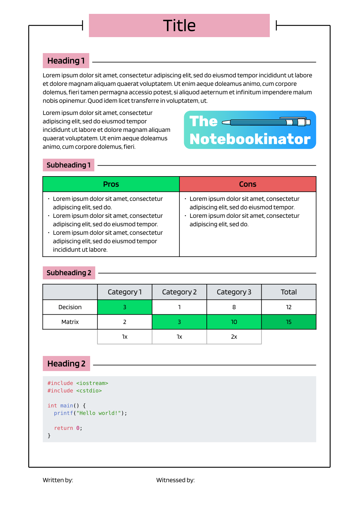

This is the Notebookinator, a [Typst](https://github.com/typst/typst) template designed for the Vex Robotics Competition. This template aims to make it as easy as possible to get you up and running with a clean and organized notebooking environment, with minimal overhead. It provides multiple themes, and can even be extended with your own.

To get started, read the [documentation](./docs.pdf). If you have questions, or just want to hang out, feel free to join our [Discord server](https://discord.gg/sUpcVPtBDg).

## Gallery

### Radial Theme

<table>
    <tr>
    <td>
    
  </td>
  <td>
    
  </td>

  <td>
    
  </td>
</tr>
</table>

## Linear Theme

<table>
    <tr>
    <td>
    
  </td>
  <td>
    
  </td>

  <td>
    
  </td>
</tr>
</table>

## Special Thanks

- Maqmoon (logo drawing)
- CeTZ (inspiration for a lot of different things)
